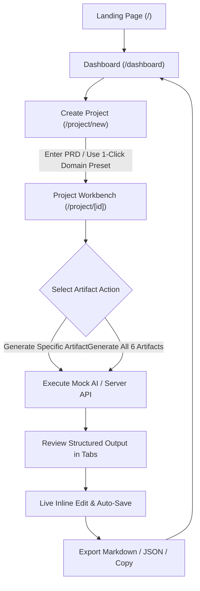

# DesignFlow AI

<p align="center">
  <strong>An open-source, AI-assisted product-design toolkit that transforms product requirements into structured UX artifacts.</strong>
</p>

<p align="center">
  <em>Current Status: Open-Source MVP / Functional Prototype (v0.1.0)</em>
</p>

<p align="center">
  <a href="#1-what-designflow-ai-is">Overview</a> •
  <a href="#4-core-features">Features</a> •
  <a href="#5-product-workflow">Workflow</a> •
  <a href="#7-local-installation">Installation</a> •
  <a href="#11-architecture-overview">Architecture</a> •
  <a href="#12-ai-provider-architecture">AI Providers</a> •
  <a href="#13-security-considerations">Security</a> •
  <a href="#14-roadmap">Roadmap</a> •
  <a href="#15-contributing">Contributing</a> •
  <a href="#16-license">License</a>
</p>

---

## 1. What DesignFlow AI Is

**DesignFlow AI** is an open-source, AI-assisted product-design toolkit designed for UX/product designers, product managers, and frontend engineers. It acts as a specialized design copilot that bridges the gap between raw feature ideas/PRDs and structured design deliverables.

Rather than authoring wireframe flows, heuristic checklists, research interview questions, and acceptance criteria from scratch, DesignFlow AI leverages domain-informed heuristics to generate structured, actionable, and accessible UX specifications in seconds.

---

## 2. Problem Statement

1. **Discovery-to-Handoff Friction**: Product requirements often lack explicit edge cases, error recovery pathways, and interaction states, leading to misaligned design handoffs and engineering delays.
2. **Repetitive Documentation Overhead**: Authoring comprehensive usability testing scripts, Gherkin acceptance criteria, and heuristic accessibility audits consumes hours of manual effort.
3. **Inconsistent Heuristic Adoption**: Teams without dedicated senior UX researchers or accessibility leads frequently overlook WCAG 2.2 touch targets, contrast ratios, and Nielsen Norman error prevention guidelines.
4. **Vendor Lock-In in AI Tools**: Many existing generative tools are closed-source, hardcoded to proprietary LLM endpoints, and transmit private product requirements without clear client-side privacy boundaries.

---

## 3. Target Users

| Persona | Primary Needs & Use Cases in DesignFlow AI |
|---|---|
| **Product & UX Designers** | Map happy paths, decision forks, UI component touchpoints, and error recovery states before opening Figma. |
| **Product Managers (PMs)** | Transform unstructured PRDs and feature requests into standardized user stories with Given-When-Then criteria. |
| **UX Researchers & Design Leads** | Generate semi-structured interview guides, probing questions, hypothesis matrices, and usability testing protocols. |
| **Frontend & Design Engineers** | Gain upfront visibility into component states, accessibility constraints, and validation rules. |

---

## 4. Core Features

### 🧩 1. Interactive User Flows
- Step-by-step critical path mapping (step name, user action, system response, UI component touchpoint, user emotion/intent).
- Decision point badges, alternative branch inspector, and edge case recovery handling with severity ratings (**High**, **Medium**, **Low**).
- **Live Inline Editing**: Add, modify, or remove steps with instant local auto-save.

### 🛡️ 2. UX & Heuristic Accessibility Audits
- Automated heuristic evaluations mapped against the **Nielsen Norman 10 Usability Heuristics** and **WCAG 2.2 AA/AAA guidelines**.
- Overall UX health score meter (0–100), severity filters (**Critical Blocker**, **Major Friction**, **Minor**, **Enhancement**), and actionable UI pattern fix recommendations.
- Priority remediation checklist.

### 📋 3. Agile User Stories & Gherkin Criteria
- Standardized user stories (`As a [Persona], I want to [Action], So that [Benefit]`).
- Syntax-highlighted **Gherkin (`Given-When-Then`)** acceptance criteria blocks.
- Technical edge case considerations and story point estimates.

### 🔍 4. User Research & Interview Guides
- Semi-structured interview question guides organized by category (*Behavior*, *Pain Point*, *Mental Model*, *Validation*, *Pricing*).
- Probing follow-up scripts, target insight definitions, and hypothesis validation matrices with risk ratings.
- Quantitative and qualitative survey prompt templates.

### 🧪 5. Usability Testing Plans
- Participant task scenarios, moderator scripts, success criteria, and time-on-task limits.
- Quantitative metric collection templates (**System Usability Scale - SUS**, **Single Ease Question - SEQ**, **Task Completion Rate**).
- Post-test debrief questions.

### 📄 6. Design Specifications & Briefs
- Target persona mental models and core pain points to mitigate.
- Core design principles with tactical guidelines.
- Spatial density, typography hierarchy, and WCAG 2.2 touch target rules (>= 48px).
- Execution phases and milestone deliverables.

### 💾 7. Export, Copy & Local Persistence
- **1-Click Markdown Export**: Formatted for Notion, Linear, GitHub Discussions, and Confluence.
- **Structured JSON Export**: Schema for programmatic pipelines and developer tooling.
- **Workspace Backup & Restore**: Full JSON workspace export and import.
- **Client-Side Privacy**: All data is stored in browser `localStorage`.

---

## 5. Product Workflow



---

## 6. Technology Stack

- **Framework**: [Next.js 14](https://nextjs.org/) (App Router, Node.js runtime)
- **Language**: [TypeScript](https://www.typescriptlang.org/) (Strict Mode)
- **Styling**: [Tailwind CSS 3.4](https://tailwindcss.com/) with custom design tokens, dark obsidian theme, and tactile micro-interactions
- **Icons**: [Lucide React](https://lucide.dev/)
- **State & Storage**: Client-side `localStorage` with JSON serialization and backup/restore
- **Code Quality**: ESLint 8 (`eslint-config-next`), PostCSS, Autoprefixer

---

## 7. Local Installation

### Prerequisites
- **Node.js**: `v18.0.0` or higher (Tested on `v22.14.0`)
- **npm**: `v9.0.0` or higher (Tested on `11.1.0`)

### Installation Steps

1. **Clone the repository:**
   ```bash
   git clone https://github.com/SahilSharmaBhardwaj/designflow-ai.git
   cd designflow-ai
   ```

2. **Install dependencies:**
   ```bash
   npm install
   ```

3. **Configure environment variables (Optional):**
   ```bash
   cp .env.example .env.local
   ```
   *(By default, `AI_PROVIDER=mock` is active. Zero API keys are needed to run all features locally).*

---

## 8. Environment Variables

Create a `.env.local` file in the project root to configure custom settings. 

> **Important**: Never commit `.env.local` or real API keys to version control.

```env
# ==============================================================================
# DesignFlow AI - Environment Configuration Template
# ==============================================================================

# AI Provider Selection
# Options: "mock" (default, runs offline with zero API keys required), "anthropic", "openai"
AI_PROVIDER=mock

# Anthropic Claude API Configuration (Optional - only needed if AI_PROVIDER=anthropic)
# Format: sk-ant-api03-...
ANTHROPIC_API_KEY=
ANTHROPIC_MODEL=claude-3-5-sonnet-20241022

# OpenAI API Configuration (Optional - only needed if AI_PROVIDER=openai)
OPENAI_API_KEY=
OPENAI_MODEL=gpt-4o

# Application Metadata
NEXT_PUBLIC_APP_NAME="DesignFlow AI"
NEXT_PUBLIC_APP_URL=http://localhost:3000
```

---

## 9. Development Commands

| Command | Action |
|---|---|
| `npm run dev` | Start Next.js local development server on `http://localhost:3000` |
| `npm run typecheck` | Run static typechecking across all TypeScript files (`tsc --noEmit`) |
| `npm run lint` | Run ESLint validation (`next lint`) |

---

## 10. Production Build

To build and run the optimized production bundle:

```bash
# 1. Generate optimized production build
npm run build

# 2. Start the production server
npm start
```

---

## 11. Architecture Overview

```tree
designflow-ai/
├── src/
│   ├── app/
│   │   ├── api/
│   │   │   ├── generate/route.ts       # Server-side AI generation endpoint
│   │   │   └── health/route.ts         # Provider status diagnostic endpoint
│   │   ├── dashboard/page.tsx          # Project management workspace & search
│   │   ├── project/
│   │   │   ├── new/page.tsx            # Project creation & requirements wizard
│   │   │   └── [id]/page.tsx           # Main workbench & artifact tabs
│   │   ├── docs/page.tsx               # In-app interactive documentation reader
│   │   ├── settings/page.tsx           # AI provider status & storage backup
│   │   ├── layout.tsx                  # Root HTML layout with navbar & footer
│   │   ├── page.tsx                    # Public landing page with live demo tabs
│   │   └── globals.css                 # Tailwind design tokens, dark mode, animations
│   ├── components/
│   │   ├── ui/                         # Primitives (Button, Badge, Card, Modal, Tabs)
│   │   ├── layout/                     # Navbar, Footer
│   │   └── artifacts/                  # UserFlowView, UXAuditView, UserStoriesView,
│   │                                   # ResearchView, UsabilityTestView, DesignBriefView,
│   │                                   # ExportModal
│   └── lib/
│       ├── ai/                         # AIProvider interface, Mock AI, Anthropic, OpenAI, Factory
│       ├── storage/                    # LocalStorage persistence & sample templates
│       ├── types/                      # Domain TypeScript interfaces
│       └── utils/                      # Markdown & JSON export formatting
├── docs/
│   ├── product.md                      # Product specifications & heuristics
│   ├── architecture.md                 # System architecture & security model
│   └── roadmap.md                      # Milestones and development plan
├── .env.example                        # Template environment variables
├── .gitignore                          # Git ignore definitions
├── CONTRIBUTING.md                     # Contributor guidelines
├── LICENSE                             # MIT License
├── package.json                        # Project dependencies and scripts
├── postcss.config.js                   # PostCSS pipeline configuration
├── tailwind.config.js                  # Tailwind design system tokens
└── tsconfig.json                       # TypeScript compiler configuration
```

---

## 12. AI Provider Architecture

All AI artifact generation is decoupled behind a unified `AIProvider` interface:

```typescript
export interface AIProvider {
  id: string;
  name: string;
  generate(request: GenerationRequest): Promise<GenerationResult>;
  validate(): Promise<{ valid: boolean; message?: string }>;
  getModelInfo(): ProviderModelInfo;
}
```

### Supported Providers

1. **Mock AI Engine (`mock`)** — *Active Default*
   - Built-in heuristic rule engine.
   - Synthesizes domain-tailored UX artifacts using structured FinTech and SaaS design templates.
   - Runs offline with zero latency costs and zero external network calls.
   - *Clearly labeled internally as Mock AI (does not pretend to be Claude or an external API).*

2. **Anthropic Claude (`anthropic`)**
   - Integrates with the Anthropic Messages API (`claude-3-5-sonnet-20241022`).
   - Activated strictly server-side when `ANTHROPIC_API_KEY` is present in `.env.local`.

3. **OpenAI (`openai`)**
   - Integrates with OpenAI Chat Completions API (`gpt-4o`).
   - Activated strictly server-side when `OPENAI_API_KEY` is present in `.env.local`.

---

## 13. Security Considerations

- **Zero Client-Side Key Exposure**: External API keys (`ANTHROPIC_API_KEY`, `OPENAI_API_KEY`) are evaluated exclusively inside server-side Next.js Route Handlers (`/api/generate`). No keys or secrets are ever bundled into client JavaScript or exposed to browser network tabs.
- **Safe Environment Defaults**: `.env` and `.env*.local` files are ignored in `.gitignore`. `.env.example` contains only placeholder dummy values.
- **Local-First Privacy**: User projects, requirements, and generated artifacts are stored in the user's browser `localStorage`. No analytics or telemetry trackers are injected.
- **Sanitized Error Logging**: Upstream provider errors (e.g. rate limits, network timeouts) are caught and returned as user-friendly messages without leaking connection headers or authorization tokens.

---

## 14. Roadmap

### 🟢 Current Release (v0.1.0 MVP — Completed)
- [x] Full Next.js 14 + TypeScript + Tailwind CSS architecture.
- [x] 6 core UX artifact generators (User Flows, UX Audits, User Stories, Research Guides, Usability Tests, Design Briefs).
- [x] Pluggable `AIProvider` interface with offline Mock AI fallback.
- [x] Production-ready Anthropic Claude & OpenAI provider integration.
- [x] Live inline editing and auto-saving for all 6 artifact types.
- [x] 1-click export to formatted Markdown (for Notion/Linear) and JSON.
- [x] Project workspace management with search, domain filtering, and JSON backup/restore.

### 🟡 Phase 2: Visual Canvas & Tool Integrations (Planned)
- [ ] Interactive node-based flowchart canvas with drag-and-drop layout.
- [ ] SVG / PNG diagram export.
- [ ] Figma plugin integration for 1-click frame creation.
- [ ] PDF and Markdown PRD file ingestion.

### 🔵 Phase 3: Advanced Intelligence (Future Research)
- [ ] Multi-agent design review studio (Accessibility vs Conversion trade-off critique).
- [ ] Automated W3C design token JSON synchronization.
- [ ] Multi-user cloud collaboration workspaces with RBAC.

---

## 15. Contributing

Contributions are welcome from product designers, UX researchers, and developers!

1. Fork the repository.
2. Create a feature branch: `git checkout -b feature/your-feature-name`.
3. Commit your changes with meaningful messages: `git commit -m "feat(audit): add touch target heuristic rule"`.
4. Validate changes:
   ```bash
   npm run typecheck
   npm run lint
   npm run build
   ```
5. Open a Pull Request on GitHub.

See [CONTRIBUTING.md](CONTRIBUTING.md) for detailed guidelines.

---

## 16. License

This project is open-source and licensed under the [MIT License](LICENSE).
