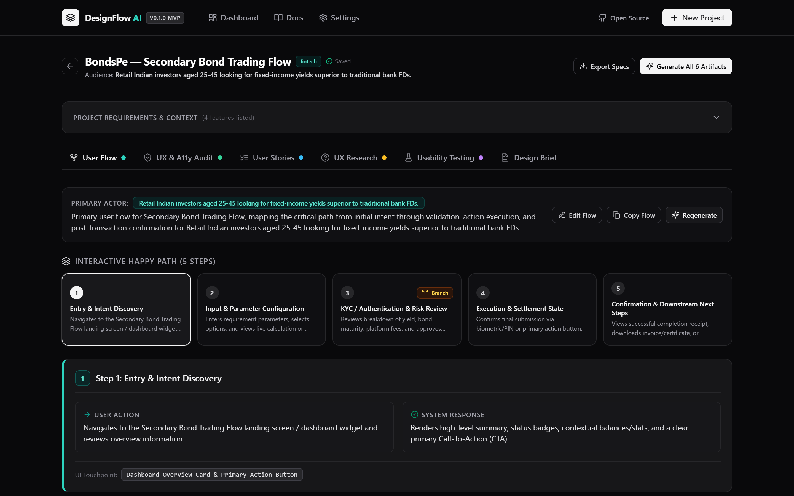
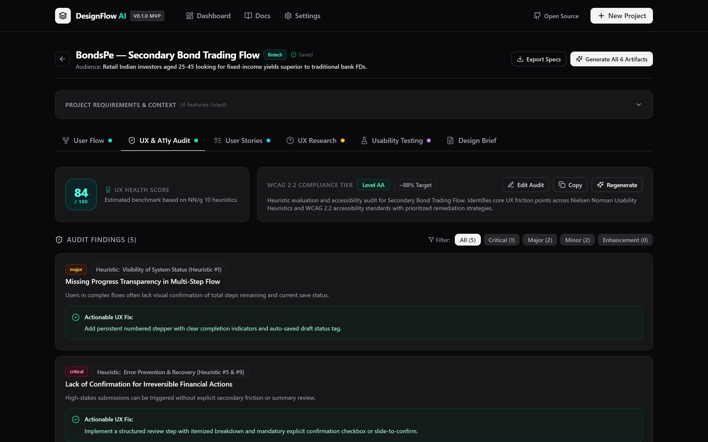
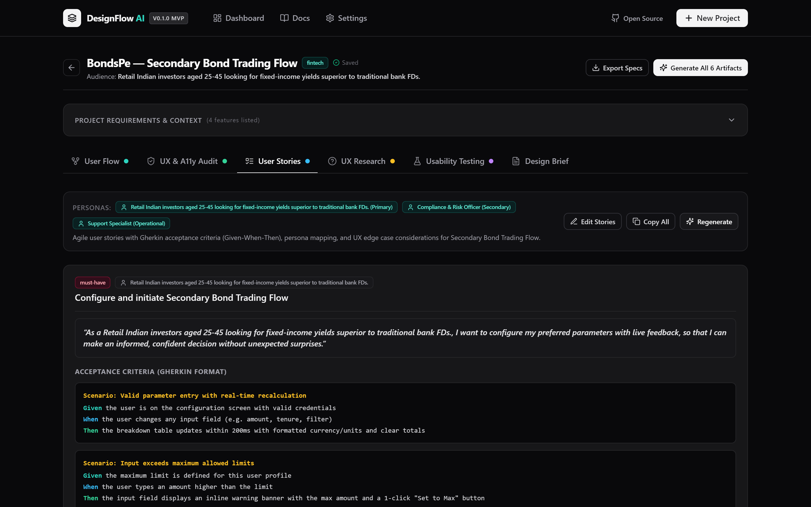
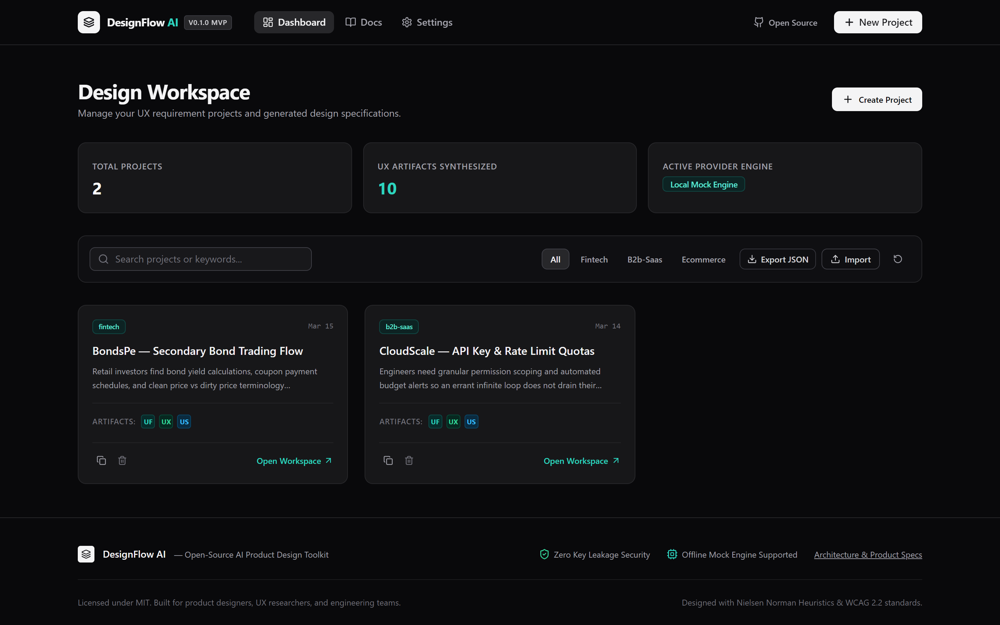
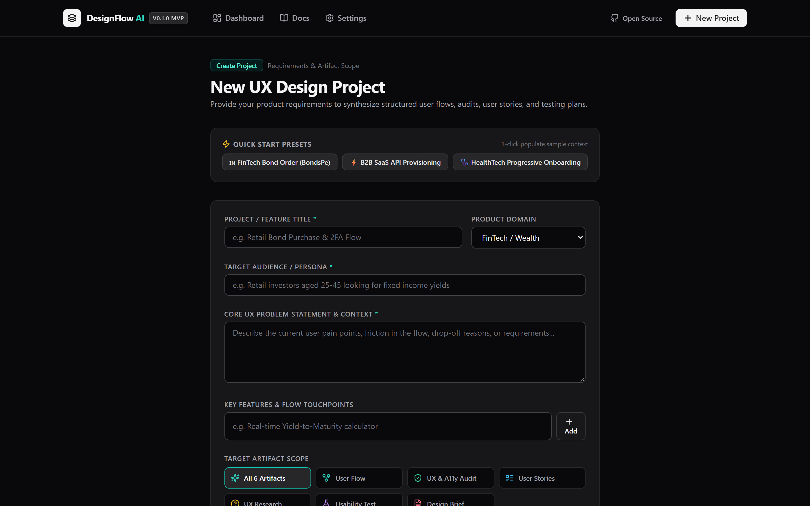
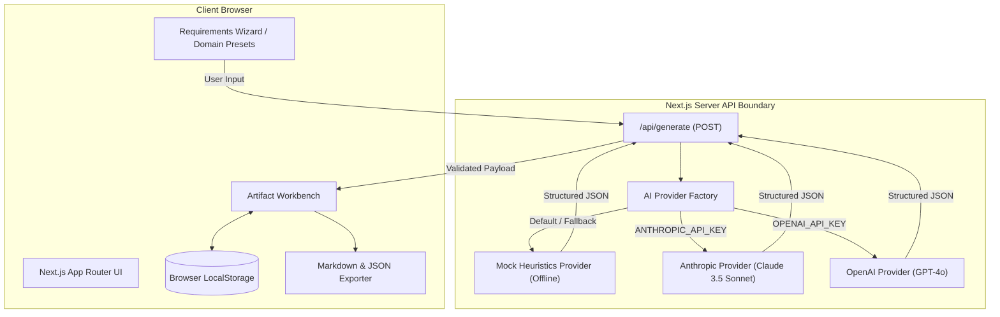

# DesignFlow AI

> **DesignFlow AI is an open-source AI-assisted toolkit for turning product requirements into structured UX artifacts.**

[](LICENSE)
[](https://designflow-ai-bice.vercel.app/)
[](https://nextjs.org/)
[](https://www.typescriptlang.org/)
[](https://tailwindcss.com/)
[]()

> 🚀 **Live Demo:** [https://designflow-ai-bice.vercel.app/](https://designflow-ai-bice.vercel.app/)

---

## Overview

Product teams, solo founders, and UX designers frequently struggle with the manual, repetitive friction of transforming raw product requirement documents (PRDs) or feature ideas into concrete design deliverables. 

**DesignFlow AI** is a functional open-source prototype that bridges the gap between product strategy and UX execution. Given a product requirement or problem statement, DesignFlow AI structures and generates **6 industry-standard UX artifacts** adhering to usability heuristics and accessibility standards:

1. **Step-by-Step User Flows** (Linear happy paths, branch conditions, recovery states, edge cases).
2. **UX & Accessibility Audits** (Evaluated against the **Nielsen Norman Group 10 Usability Heuristics** and **WCAG 2.2 AA** criteria).
3. **Agile User Stories & Acceptance Criteria** (Syntax-highlighted **Gherkin Given-When-Then** test scenarios).
4. **UX Research Interview Guides** (Targeted discovery questions, probing follow-ups, and risk hypotheses).
5. **Usability Testing Plans** (Moderator scripts, realistic task scenarios, and quantitative SUS / SEQ metric tracking).
6. **Design Briefs & Mental Models** (Design principles, visual tokens, spatial density rules, and milestone deliverables).

---

## Application Previews & Screenshots

### 1. Interactive Workbench (User Flow Pipeline)


### 2. UX & Accessibility Audit (NN/g 10 Heuristics & WCAG 2.2 AA)


### 3. Agile User Stories (Gherkin Given-When-Then Scenarios)


### 4. Workspace Dashboard & Project Repository


### 5. Requirements Ingestion Wizard with Domain Presets


---

## Problem Statement

When starting a new feature or product iteration, teams encounter three recurring bottlenecks:
- **Scattered Artifacts**: Flow charts in Miro, acceptance criteria in Jira, heuristics checklists in Notion, and interview guides in Google Docs.
- **Overlooked Usability Edge Cases**: Edge cases (network timeouts, ambiguous error states, compliance disclaimers) are often discovered late in the development cycle.
- **Inconsistent UX Standards**: Junior designers and developers may lack structured frameworks for WCAG 2.2 contrast compliance or Jakob Nielsen's 10 usability heuristics.

DesignFlow AI centralizes this thinking into a single, cohesive developer-and-designer workbench.

---

## Target Audience

| Persona | Primary Use Case |
| :--- | :--- |
| **Product & UX Designers** | Rapidly generate base flow diagrams, usability interview scripts, and heuristics checklists before opening Figma. |
| **Solo Founders & Builders** | Transform raw feature ideas into rigorous UX specifications without requiring an enterprise design agency. |
| **Product Managers** | Instantly produce Gherkin-formatted acceptance criteria and edge-case maps for engineering kickoffs. |
| **Frontend Engineers** | Reference state-by-state UX flows, error recovery branches, and WCAG accessibility guidelines during UI implementation. |

---

## The 6 Core UX Artifacts

### 1. User Flows & Branching Logic
- Explicit step sequencing (`Step 1` &rarr; `Step N`).
- Branching triggers (e.g., KYC verified vs. KYC pending).
- Fallback paths and inline error recovery states.

### 2. Heuristic & Accessibility UX Audit
- 10 Nielsen Norman Usability Heuristic evaluations with severity tagging (**Critical**, **High**, **Medium**, **Low**).
- Actionable design recommendations.
- WCAG 2.2 AA compliance checklist (contrast ratios, focus indicators, minimum touch targets $\ge 48\text{px}$).

### 3. Agile User Stories & Gherkin Scenarios
- Agile format: `As a <user>, I want <goal> so that <benefit>`.
- Gherkin test syntax:
  ```gherkin
  Given the investor has selected a AAA-rated corporate bond
  When they enter an order quantity exceeding available liquidity
  Then display a real-time warning with maximum purchasable lots
  ```

### 4. Qualitative UX Research Plans
- Problem discovery and behavioral interview questions.
- Adaptive probing prompts for user interviews.
- Pre-launch hypothesis risk matrix.

### 5. Usability Testing Protocol
- Pre-test moderator briefing and consent scripts.
- Realistic task scenarios with measurable success criteria.
- Quantitative scoring frameworks: System Usability Scale (SUS) and Single Ease Question (SEQ).

### 6. Design Brief & Spatial System
- User mental model and core value proposition.
- Visual token guidance (dark obsidian theme, typography scales, contrast tokens).
- Spatial density specifications and iterative delivery milestones.

---

## Technology Stack

- **Framework**: [Next.js 14](https://nextjs.org/) (App Router, Server Components, API Route Handlers)
- **Language**: [TypeScript 5.7](https://www.typescriptlang.org/) (Strict mode, full end-to-end type safety)
- **Styling**: [Tailwind CSS 3.4](https://tailwindcss.com/) (Custom obsidian design tokens, dark mode palette, smooth transitions)
- **Icons**: [Lucide React](https://lucide.dev/) (Curated, consistent SVG icons)
- **State & Storage**: Client-side `localStorage` with JSON schema backup & restore (no cloud DB setup required to run locally)
- **AI Layer**: Server-side pluggable provider abstraction (`AIProvider` interface) supporting:
  - **Local Heuristics Engine (Mock)**: Zero API keys needed; fully functional out of the box.
  - **Anthropic Claude 3.5 Sonnet**: High-precision reasoning for complex UX edge cases.
  - **OpenAI GPT-4o**: Structured JSON generation for rapid prototyping.

---

## Architecture & Data Flow



---

## Quickstart & Local Installation

### Prerequisites
- **Node.js**: `v18.17.0` or higher
- **npm**: `v9.0.0` or higher (or `pnpm` / `yarn`)

### 1. Clone the Repository
```bash
git clone https://github.com/SahilSharmaBhardwaj/designflow-ai.git
cd designflow-ai
```

### 2. Install Dependencies
```bash
npm install
```

### 3. Configure Environment Variables (Optional)
DesignFlow AI runs **100% offline out-of-the-box** using the local heuristics engine. No external API keys are required to explore all features.

To enable live LLM generation with Anthropic or OpenAI:
```bash
cp .env.example .env.local
```

Edit `.env.local`:
```env
# Choose provider: 'mock' (default), 'anthropic', or 'openai'
AI_PROVIDER=mock

# Anthropic Claude API Key (Optional)
ANTHROPIC_API_KEY=your_anthropic_api_key_here

# OpenAI API Key (Optional)
OPENAI_API_KEY=your_openai_api_key_here
```

### 4. Start Development Server
```bash
npm run dev
```

Open [http://localhost:3000](http://localhost:3000) in your browser.

---

## Development Commands

| Command | Description |
| :--- | :--- |
| `npm run dev` | Starts local Next.js development server at `http://localhost:3000` |
| `npm run build` | Compiles optimized Next.js production build |
| `npm run start` | Runs the compiled production server |
| `npm run lint` | Runs ESLint check across all TypeScript and React files |
| `npm run typecheck` | Validates TypeScript types across the entire project |

---

## Security & Privacy Considerations

- **Zero Client-Side Key Exposure**: External LLM API keys (`ANTHROPIC_API_KEY`, `OPENAI_API_KEY`) are accessed strictly inside server-side Next.js route handlers (`/api/generate`). No keys are ever bundled into client-side JavaScript.
- **Local Data Storage**: Project requirements and generated artifacts are stored locally in the user's browser `localStorage`. No user requirement data is sent to external servers unless an external AI provider is explicitly configured.
- **No Insecure Eval or Remote Code**: Generation flows return validated JSON schema objects, preventing script injection.

For full security policy and vulnerability reporting, see [SECURITY.md](SECURITY.md).

---

## Product Roadmap

> DesignFlow AI is an active open-source MVP (`v0.1.0`). Below is our planned development roadmap:

### Phase 1: MVP Core (Completed & Released &mdash; v0.1.0)
- [x] Next.js 14 App Router foundation with responsive obsidian design system.
- [x] 6 Structured UX Artifact generation modules with live inline editing.
- [x] Offline heuristics engine (`MockProvider`) with domain presets (FinTech, SaaS, HealthTech).
- [x] Server-side AI provider abstraction for Claude 3.5 Sonnet and GPT-4o.
- [x] 1-click Markdown export (formatted for Notion/Linear) and JSON spec export.
- [x] LocalStorage persistence with JSON backup import and export.

### Phase 2: Visual Canvas & Node Diagrams (In Progress)
- [ ] Interactive node canvas (drag-and-drop user flow visualizer).
- [ ] SVG and PNG export for visual user flow graphs.
- [ ] Multi-scenario branching editor for user flows.

### Phase 3: Ingestion & Collaboration (Planned)
- [ ] PRD file upload and parsing (Markdown, PDF, Notion doc paste).
- [ ] Figma token import / design token JSON generator.
- [ ] Sharable project links via client-side state compression.

### Phase 4: Custom Heuristic Rule Engines (Future)
- [ ] User-customizable heuristic audit rules and regulatory checklists (e.g., GDPR, HIPAA, SEBI).
- [ ] Automated accessibility contrast ratio verification for color palettes.

---

## Contributing

We welcome contributions from designers, product managers, and software engineers!

Please read our [CONTRIBUTING.md](CONTRIBUTING.md) guide for instructions on:
- Setting up your local development environment
- Coding standards and component guidelines
- Branch naming and commit conventions
- Submitting Pull Requests

Please adhere to our [Code of Conduct](CONTRIBUTING.md#code-of-conduct) in all community interactions.

---

## Issue Templates

- 🐛 [Report a Bug](.github/ISSUE_TEMPLATE/bug_report.md)
- 💡 [Request a Feature or New Artifact Type](.github/ISSUE_TEMPLATE/feature_request.md)

---

## Author & Credits

Designed and developed by **Sahil Sharma** — UX/Product Designer with FinTech product experience (BondsPe), M.Des in UX Design, BCA.

---

## License

This project is licensed under the **MIT License** &mdash; see the [LICENSE](LICENSE) file for details.
